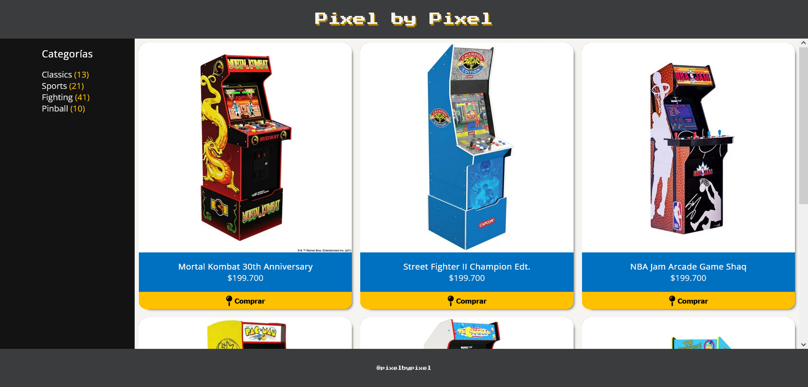

# Desafío 2 - Layout de E-Commerce con Grid 🛒

## ¡Hola a todos! 👋
En esta ocasión trabajé en el diseño de un layout de una tienda online básica utilizando CSS Grid. Vamos a echar un vistazo a lo que logré.

## Descripción del Proyecto 🚀
En este desafío, maqueté la vista de una tienda online básica, incorporando un menú de navegación, una barra lateral con la cantidad de productos por categoría, una grilla de productos y un pie de página.

## Resultado Final 🎉
¡Aquí está el resultado final de mi proyecto!

### Observaciones y Recomendaciones 🧐
- Utilicé CSS Grid y su propiedad `grid-template-areas` para crear el layout general del proyecto.
- La barra lateral cuenta con un diseño flexible utilizando Flexbox para la distribución de elementos.
- Las tarjetas de productos fueron construidas utilizando Flexbox para lograr un diseño vertical.

## Experiencia del Desarrollo 🛠️
Este proyecto me llevó a aplicar mis conocimientos de CSS Grid y Flexbox. Aprendí a diseñar un layout completo para una tienda online, incorporando una grilla de productos y una barra lateral.

